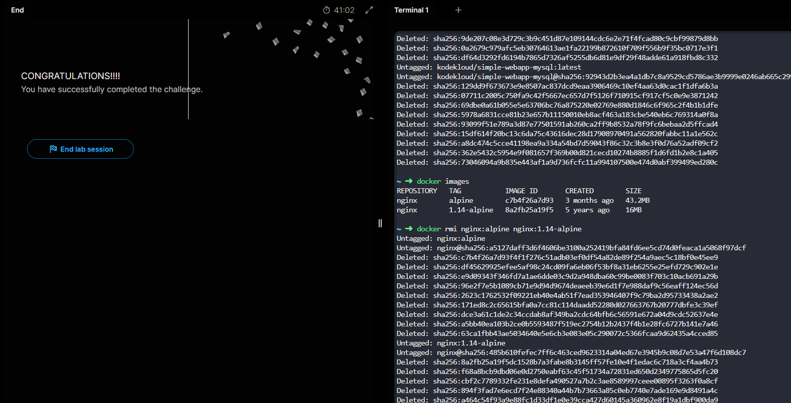
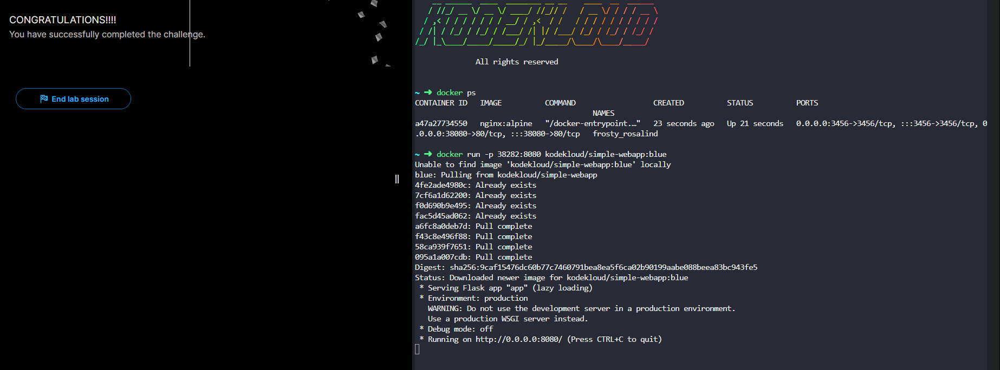
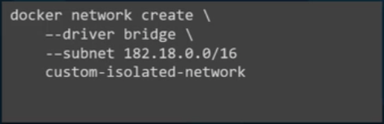
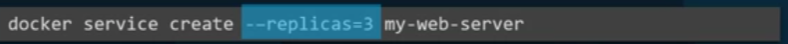
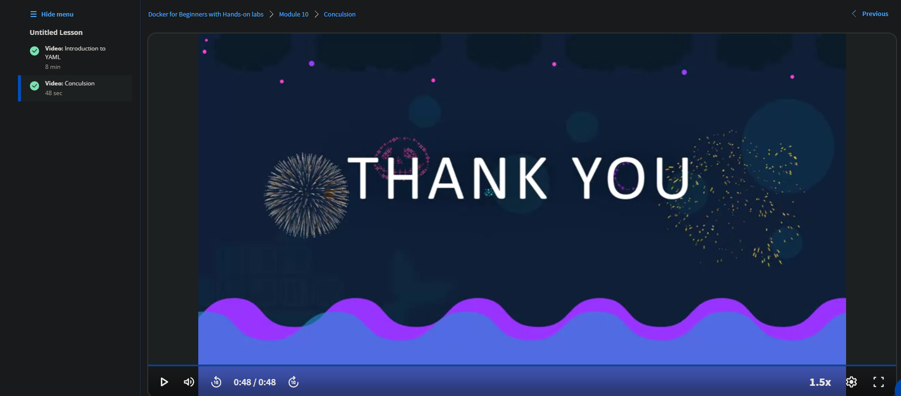

## Docker for Beginners with Hands-on labs
### module 2
docker run --name <_name_> <_image_>
-d -> detached

docker ps

docker stop <_container name_>

docker images

docker rmi <_image name_>

docker rm <_container name_>

docker pull <_image name_>

docker exec <_container name_> <_command_>

docker attach <_container name_>



### module 3
docker run -it
* -i -> interactive
* -t -> terminal

-p <_host port_>:<_container port_> -> maps port

-v <_directory to mount_>:<_where it will be mounted on the image_> -> volume mapping

docker inspect <_container name_>

docker logs <_container name_>



### module 4
```Dockerfile
FROM <image>

RUN <some command>

COPY <from> <to>

ENTRYPOINT <run command>
```

docker build <_path to Dockerfile_> -t <account_name>:<image_name>

docker push <account_name>:<image_name>

-e -> set environment var during docker run

### module 5
docker-compose.yml
```docker-compose
<container name>:
    image: <image name>

<container name>:
    buld: <path to folder with Dockerfile>
    ports:
        - <host>:<container>
    links:
        - <>
        - <>
    ...

...
```

docker-compose up

### module 6
cgroups -> allows for resource management

namespaces -> allows for process mapping

### module 7

docker has a built in dns server so we can connect by names

### module 8
docker on windows :)))))

### module 9

orhcestartion and clusering...

### module 10
JAMAL files


## Review
Honestly just a text book being read out. The online labs were the only redeeming part.
Unless you plan to be/apply for a DevOps position just use ChatGPT and the web to tell you what to do. Quicker and simpler.