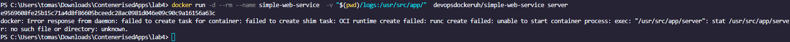

# DevOps with Docker part 1
## section 1

### Exercises 

## section 2

### exercise

## section 3

## section 4
nothing to show here

## section 5

DONT WORK FOR SOME REASON

## section 6

docker run -p 8080:8080 example-backend

1.14

1.15
ain't no way im doing a separate app
download https://github.com/docker-hy/material-applications/tree/main/example-frontend
cd example-frontend
docker run lobsterlobserski/frontend-example:latest

https://hub.docker.com/repository/docker/lobsterlobsterski/frontend-example/general

## section 7
im not gonna waste my time on _figuring out_ something that i give don't give a fuck about especially when i need to do 4 more labs and this requires my credit card or reading dogshit docs.

