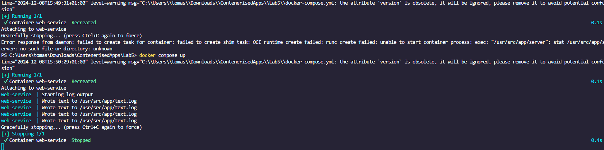
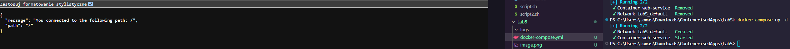
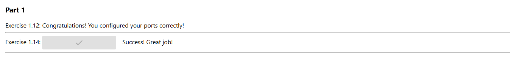
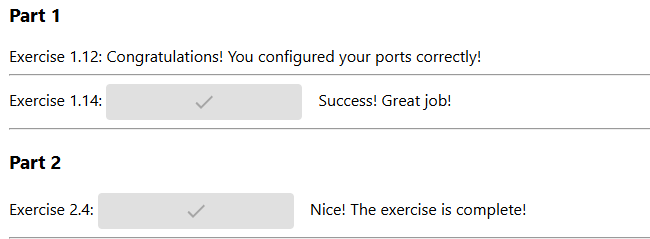
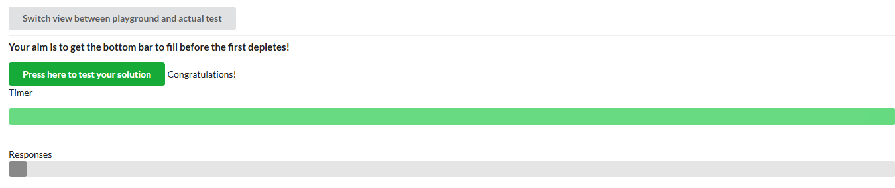
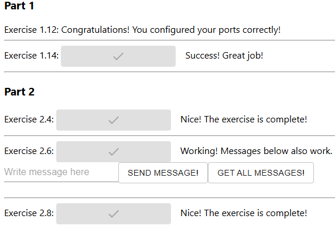
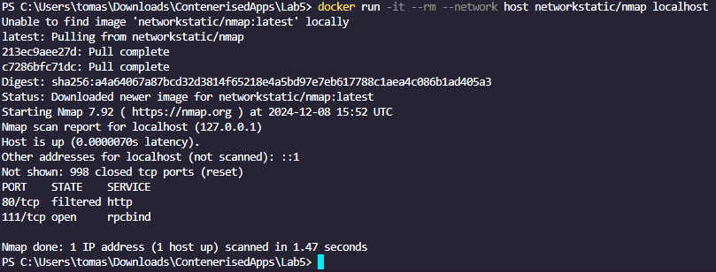

# DevOps with Docker part 2
## section 1

again it doesn't work :)))))))))))))
Error response from daemon: failed to create task for container: failed to create shim task: OCI runtime create failed: runc create failed: unable to start container process: exec: "/usr/src/app/server": stat /usr/src/app/server: no such file or directory: unknown
``` docker-compose
version: '3.8'

services:
  web-service:
    image: devopsdockeruh/simple-web-service
    container_name: web-service
    ports:
      - "80:80"
    volumes:
      - ./logs:/usr/src/app/

```


```
services:
  web-service:
    image: devopsdockeruh/simple-web-service
    container_name: web-service
    command: ["server"]
    ports:
      - "8080:8080"
```

```
services:
  backend:
    build:
      context: ./example-backend
      dockerfile: Dockerfile
    ports:
      - "8080:8080"
    environment:
      - PORT=8080
      - REQUEST_ORIGIN=http://localhost:5000
    depends_on:
      - frontend

  frontend:
    build:
      context: ./example-frontend
      dockerfile: Dockerfile
    ports:
      - "5000:5000"
    environment:
      - REACT_APP_BACKEND_URL=http://backend:8080

```


## section 2
```
services:
  backend:
    build:
      context: ./example-backend
      dockerfile: Dockerfile
    ports:
      - "8080:8080"
    environment:
      - PORT=8080
      - REQUEST_ORIGIN=http://localhost:5000
      - REDIS_HOST=redis
    depends_on:
      - frontend
      - redis

  frontend:
    build:
      context: ./example-frontend
      dockerfile: Dockerfile
    ports:
      - "5000:5000"
    environment:
      - REACT_APP_BACKEND_URL=http://backend:8080

  redis:
    image: "redis:latest"
    ports:
      - "6379:6379"
    command: redis-server
```


```
services:
  calculator:
    image: devopsdockeruh/scaling-exercise-calculator
    ports:
      - "3000:3000"
    container_name: calculator

  compute:
    image: devopsdockeruh/scaling-exercise-compute
    environment:
      - VIRTUAL_HOST=compute.localtest.me

  load-balancer:
    build: ./load-balancer
    image: load-balancer
    volumes: 
      - /var/run/docker.sock:/tmp/docker.sock:ro
    ports:
      - "80:80"
    container_name: load-balancer

```
` docker-compose up --scale compute=5 --build `



## section 3
```
services:
  backend:
    build:
      context: ./example-backend
      dockerfile: Dockerfile
    ports:
      - "8080:8080"
    environment:
      - PORT=8080
      - REQUEST_ORIGIN=http://localhost:5000
      - REDIS_HOST=redis
      - POSTGRES_HOST=postgres
      - POSTGRES_USER=postgres
      - POSTGRES_PASSWORD=postgres
      - POSTGRES_DATABASE=messages
    depends_on:
      - frontend
      - redis
      - postgres

  frontend:
    build:
      context: ./example-frontend
      dockerfile: Dockerfile
    ports:
      - "5000:5000"
    environment:
      - REACT_APP_BACKEND_URL=http://backend:8080

  redis:
    image: "redis:latest"
    ports:
      - "6379:6379"
    command: redis-server

  postgres:
    image: postgres:latest
    environment:
      POSTGRES_USER: postgres
      POSTGRES_PASSWORD: postgres
      POSTGRES_DB: messages
    ports:
      - "5432:5432"
```


```
services:
  backend:
    build:
      context: ./example-backend
      dockerfile: Dockerfile
    ports:
      - "8080:8080"
    environment:
      - PORT=8080
      - REQUEST_ORIGIN=http://localhost:5000
      - REDIS_HOST=redis
      - POSTGRES_HOST=postgres
      - POSTGRES_USER=postgres
      - POSTGRES_PASSWORD=postgres
      - POSTGRES_DATABASE=messages
    depends_on:
      - frontend
      - redis
      - postgres

  frontend:
    build:
      context: ./example-frontend
      dockerfile: Dockerfile
    ports:
      - "5000:5000"
    environment:
      - REACT_APP_BACKEND_URL=http://backend:8080

  redis:
    image: "redis:latest"
    ports:
      - "6379:6379"
    command: redis-server

  postgres:
    image: postgres:latest
    environment:
      POSTGRES_USER: postgres
      POSTGRES_PASSWORD: postgres
      POSTGRES_DB: messages
    ports:
      - "5432:5432"
    volumes:
      - ./database:/var/lib/postgresql/data
```

honestly no idea why the bind mount works now and it didnt before.

```
services:
  nginx:
    image: nginx:latest
    ports:
      - "80:80"
    volumes:
      - ./nginx.conf:/etc/nginx/nginx.conf:ro
    depends_on:
      - frontend
      - backend
    networks:
      - app-network

  backend:
    build:
      context: ./example-backend
      dockerfile: Dockerfile
    environment:
      - PORT=8080
      - REQUEST_ORIGIN=http://localhost
      - REDIS_HOST=redis
      - POSTGRES_HOST=postgres
      - POSTGRES_USER=postgres
      - POSTGRES_PASSWORD=postgres
      - POSTGRES_DATABASE=messages
    expose:
      - "8080"
    networks:
      - app-network

  frontend:
    build:
      context: ./example-frontend
      dockerfile: Dockerfile
    environment:
      - REACT_APP_BACKEND_URL=http://localhost/api
    expose:
      - "5000"
    networks:
      - app-network

  redis:
    image: redis:latest
    command: redis-server
    networks:
      - app-network

  postgres:
    image: postgres:latest
    environment:
      POSTGRES_USER: postgres
      POSTGRES_PASSWORD: postgres
      POSTGRES_DB: messages
    volumes:
      - ./database:/var/lib/postgresql/data
    networks:
      - app-network

networks:
  app-network:
    driver: bridge

```


```
version: "3.8"

services:
  nginx:
    image: nginx:latest
    ports:
      - "80:80"
    volumes:
      - ./nginx.conf:/etc/nginx/nginx.conf:ro
    depends_on:
      - frontend
      - backend
    networks:
      - app-network

  backend:
    build:
      context: ./example-backend
      dockerfile: Dockerfile
    environment:
      - PORT=8080
      - REQUEST_ORIGIN=http://localhost
      - REDIS_HOST=redis
      - POSTGRES_HOST=postgres
      - POSTGRES_USER=postgres
      - POSTGRES_PASSWORD=postgres
      - POSTGRES_DATABASE=messages
    expose:
      - "8080"
    networks:
      - app-network

  frontend:
    build:
      context: ./example-frontend
      dockerfile: Dockerfile
    environment:
      - REACT_APP_BACKEND_URL=http://localhost/api
    expose:
      - "5000"
    networks:
      - app-network

  redis:
    image: redis:latest
    command: redis-server
    networks:
      - app-network

  postgres:
    image: postgres:latest
    environment:
      POSTGRES_USER: postgres
      POSTGRES_PASSWORD: postgres
      POSTGRES_DB: messages
    volumes:
      - ./database:/var/lib/postgresql/data
    networks:
      - app-network

networks:
  app-network:
    driver: bridge

```
changes
```
http://localhost/api
```



## section 4
Don't have any projects like that and I'm thankful for that.

## section 5
nothing to do here


