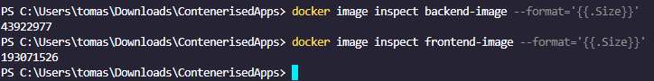

# DevOps with Docker part 3
## Section 2


https://github.com/LobsterLobsterski/anotherRepo

Not doing 3.2...


## Section 3


Everything works :)

# Section 4


```
FROM golang:1.16 AS build

WORKDIR /app
COPY . ./
RUN CGO_ENABLED=0 GOOS=linux go build -o server

FROM alpine:latest

WORKDIR /app
# Create the non-root user and set permissions
RUN addgroup -S appgroup && adduser -S appuser -G appgroup && \
    chown -R appuser:appgroup /app

# Copy the built binary from the previous stage
COPY --from=build /app/server ./ 

# Install certificates and clean up
RUN apk --no-cache add ca-certificates && \
    rm -rf /var/cache/apk/*

USER appuser

ENV PORT=8080 REQUEST_ORIGIN=http://localhost \
    REDIS_HOST=redis POSTGRES_HOST=postgres \
    POSTGRES_USER=postgres POSTGRES_PASSWORD=postgres \
    POSTGRES_DATABASE=messages

EXPOSE 8080
CMD ["./server"]

```

44mb -> 27mb

```
FROM node:16 AS build

WORKDIR /app
COPY public ./public
COPY src ./src
COPY package.json ./package.json
COPY package-lock.json ./package-lock.json
RUN npm install && \
    REACT_APP_BACKEND_URL=http://localhost/api npm run build

FROM node:16-slim

# Create /app directory and a non-root user
WORKDIR /app
RUN mkdir -p /app/build && \
    addgroup --system appgroup && \
    adduser --system --ingroup appgroup appuser && \
    npm install -g serve && \
    chown -R appuser:appgroup /app && \
    rm -rf /root/.npm /tmp/*

# Copy the build artifacts
COPY --from=build /app/build /app/build

USER appuser
EXPOSE 5000
CMD ["serve", "-s", "-l", "5000", "/app/build"]
```

193mb -> 185mb

### 3.7

```
FROM golang:1.20-alpine as builder
WORKDIR /app

COPY go.mod go.sum ./
RUN go mod download

COPY . .
RUN go build -o main .

FROM alpine:latest
WORKDIR /root/

COPY --from=builder /app/main .

EXPOSE 8080
CMD ["./main"]
```
27mb -> 26mb
```
FROM node:16-alpine AS build
WORKDIR /app

COPY package*.json ./
RUN npm install

COPY . . 
RUN REACT_APP_BACKEND_URL=http://localhost/api npm run build

FROM nginx:alpine
WORKDIR /usr/share/nginx/html

COPY --from=build /app/build .

EXPOSE 80
CMD ["nginx", "-g", "daemon off;"]

```
185mb -> 53mb

### 3.8
```
FROM node:16-alpine AS build-stage
WORKDIR /app

COPY package*.json ./
RUN npm install

COPY . . 
RUN npm run build

FROM nginx:alpine
WORKDIR /usr/share/nginx/html

COPY --from=build-stage /app/build .

EXPOSE 80

CMD ["nginx", "-g", "daemon off;"]
```

### 3.9
```
FROM golang:1.20-alpine AS build-stage

WORKDIR /app

COPY go.mod go.sum ./
RUN go mod download

COPY . .

RUN CGO_ENABLED=0 GOOS=linux go build -o app .

FROM scratch

COPY --from=build-stage /app/app /app

EXPOSE 8080

CMD ["/app"]
```


### 3.10

```
FROM golang:1.20-alpine AS build-stage
WORKDIR /app
COPY go.mod go.sum ./
RUN go mod download
COPY . .
RUN CGO_ENABLED=0 GOOS=linux GOARCH=amd64 go build -o app .

FROM scratch
COPY --from=build-stage /app/app /
ENTRYPOINT ["/app"]
EXPOSE 8080

```

```
FROM node:16-alpine AS build-stage
WORKDIR /app
COPY package*.json ./
RUN npm install
COPY . .
RUN npm run build

FROM nginx:alpine
COPY --from=build-stage /app/build /usr/share/nginx/html
EXPOSE 80
CMD ["nginx", "-g", "daemon off;"]

```

# section 5
***
Familiarize yourself with Kubernetes terminology and draw a diagram describing what "parts" the Kubernetes contain and how those are related to each other.

You should draw a diagram of at least three host machines in a Kubernetes cluster. In the diagram assume that the cluster is running two applications. The applications can be anything you want. An example could be a video game server and a blog website.

You may take inspiration from the diagrams of part 2.

The applications may utilize other machines or APIs that are not part of the cluster. At least three of the machines should be utilized. Include "your own computer" in the diagram as the one sending instructions via kubectl to deploy an application. In addition, include a HTTP message coming from the internet to your Kubernetes cluster and how it may reach an application.

Make sure to label the diagram so that anyone else who has completed this exercise, and read the glossary, would understand it. The diagram should contain at least four of the following labels: Pod, Cluster, Container, Service and Volume.

Glossary. And some helpful diagrams

I prefer to use draw.io but you can use whichever tool you want.

:::

If you are interested, later this year the course DevOps With Kubernetes will provide a comprehensive treatment on using Kubernetes.
***

**KUBERNETES DIAGRAM HERE**

# SECTION 6
nothing here!